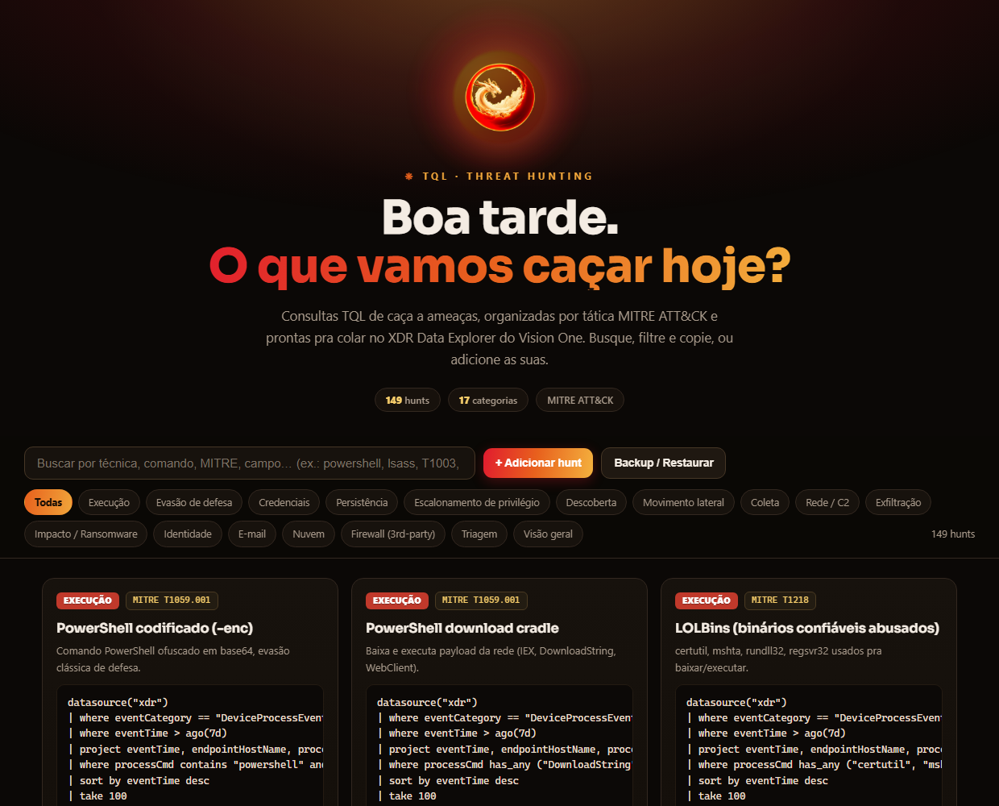

# Base de Conhecimento · Threat Hunting com TQL

[](https://github.com/VictorGiatti/tql-threat-hunting-kb/actions/workflows/validar.yml)

Consultas de caça a ameaças (threat hunting) para o **Trend Vision One → XDR Data Explorer**, escritas em **TQL (Trend Query Language)** e organizadas por tática **MITRE ATT&CK**.

**154 hunts · 17 categorias · cola de consultas · painel interativo**



---

## O que é isto

Uma base de conhecimento versionável para o time: cada hunt tem título, técnica MITRE, uma linha de descrição e a query TQL pronta pra copiar e rodar. A ideia é **ir alimentando**, todo mundo contribui com os hunts que funcionam no dia a dia.

> **Contexto (importante):** os métodos antigos de busca por *activity data* do Vision One serão **aposentados no fim de setembro de 2026**. Depois disso, o TQL com as fontes de dados expandidas passa a ser o caminho padrão, motivo a mais pra concentrar os hunts do time aqui.

A fonte dos dados é o **Data Lake do Vision One**, que reúne telemetria nativa (endpoint, identidade, e-mail, rede) **e logs de terceiros** (Fortigate, Check Point, Defender etc.). Ou seja: o mesmo hunt roda sobre tudo que está ingerido.

## Como usar

1. Abra o **Trend Vision One → XDR → Search / Data Explorer**.
2. Ative o toggle **"Use Trend Query Language"**.
3. Copie a query do hunt, cole e clique **Run query**.
4. Ajuste a janela de tempo (`ago(1h)` → `ago(1d)` → `ago(7d)`) conforme o volume.

> Prefere clicar em vez de navegar por arquivos? Abra [`painel/tql-threat-hunting.html`](painel/tql-threat-hunting.html) no navegador: é o mesmo conteúdo com busca, filtro por tática, copiar-query e um formulário pra adicionar os seus próprios hunts (salvos no navegador).

## Regras de ouro

- Sempre que souber, especifique `with (log_type="…", product_code="…")`: são filtros "de graça" e deixam a query muito mais rápida.
- Comece com janela curta e use `project` cedo pra trazer só as colunas necessárias.
- Ordene os filtros do barato pro caro: `==` e `in` antes de `contains` / `matches regex`.
- Campo em array (ex.: `tags`): use `has_any (…)`, nunca `contains`. Pra um valor só: `tags has_any ("MITRE.T1055")`.
- Linha de comando (`processCmd`, `parentCmd`): use `matches regex "(?i)(…)"`. `has`/`has_any` são case-sensitive e perdem `iex`, `C$`, `/Create`.
- Depois de `summarize ... by X`, só existem `X` e a métrica agregada: não dê `project` em coluna que o summarize removeu.
- **Zero resultado só é resposta depois de confirmado**: coluna inexistente, `log_type` errado ou regex em coluna `dynamic` também voltam vazio, sem erro. Siga o [checklist](sintaxe-e-performance.md#voltou-vazio-confirme-antes-de-concluir) antes de reportar "nada encontrado".
- Hunt com `Limitação:` diz o que a query não cobre (CIDR, decode de base64, janela de 5 min…). Leia antes de concluir.

Mais detalhes em [`sintaxe-e-performance.md`](sintaxe-e-performance.md).

## Índice

| Seção | Descrição |
|---|---|
| [Hunts (por categoria)](hunts/README.md) | Os 154 hunts organizados por tática, com técnica MITRE e query. |
| [Consultas de exemplo](consultas-de-exemplo.md) | Cola de bolso: ~25 queries prontas (aquecimento, agregação de terceiros, detecções, investigação, plano B). |
| [Sintaxe & performance](sintaxe-e-performance.md) | Regras da linguagem, campos confirmados, limites do TQL, checklist de "voltou vazio" e troubleshooting. |
| [Painel interativo](painel/tql-threat-hunting.html) | Versão HTML navegável (busca, filtro, copiar, adicionar hunt). |
| [Como contribuir](CONTRIBUTING.md) | Padrão pra adicionar um hunt novo. |

## Estrutura do repositório

```
tql-threat-hunting-kb/
├── README.md                     # este arquivo (índice da base)
├── hunts/
│   ├── README.md                       # índice dos hunts (gerado pelo scripts/kb.py build)
│   ├── execucao.md                     # Execução
│   ├── evasao-de-defesa.md             # Evasão de defesa
│   ├── credenciais.md                  # Credenciais
│   ├── persistencia.md                 # Persistência
│   ├── escalonamento-de-privilegio.md  # Escalonamento de privilégio
│   ├── descoberta.md                   # Descoberta
│   ├── movimento-lateral.md            # Movimento lateral
│   ├── coleta.md                       # Coleta
│   ├── rede-c2.md                      # Rede / C2
│   ├── exfiltracao.md                  # Exfiltração
│   ├── impacto-ransomware.md           # Impacto / Ransomware
│   ├── identidade.md                   # Identidade
│   ├── e-mail.md                       # E-mail
│   ├── nuvem.md                        # Nuvem (AWS CloudTrail)
│   ├── firewall-3rd-party.md           # Firewall (terceiros)
│   ├── triagem.md                      # Triagem
│   └── visao-geral.md                  # Visão geral / qualidade de dados
├── consultas-de-exemplo.md       # cola de bolso de queries
├── sintaxe-e-performance.md      # referência da linguagem + troubleshooting
├── painel/
│   └── tql-threat-hunting.html   # painel interativo (dados gerados a partir dos .md)
├── scripts/
│   ├── kb.py                     # lint, test, build e check da base
│   └── tqlcheck.py               # validador estático de TQL (roda sozinho numa query)
├── tests/
│   └── amostras.json             # linhas de comando que cada hunt deve / não deve pegar
├── .github/workflows/validar.yml # CI: lint + amostras + sincronia do painel
├── CONTRIBUTING.md               # como adicionar hunts
└── CHANGELOG.md                  # histórico de versões
```

## Validação

Toda query passa por um validador antes de entrar na base, e o CI roda o mesmo em cada push e Pull Request:

```bash
python scripts/kb.py lint    # funções que não existem no TQL, bin()/ago() inválidos, sem janela, sem take, has_any em linha de comando
python scripts/kb.py test    # amostras de linha de comando contra os filtros dos hunts
python scripts/kb.py build   # regera índice, contadores e os dados do painel a partir dos .md
```

Os `.md` de `hunts/` são a fonte da verdade: o painel e o índice saem deles, então nunca ficam dessincronizados.

## Clonar e usar

Time interno, é só clonar:

```bash
git clone https://github.com/VictorGiatti/tql-threat-hunting-kb.git
```

Depois, abra `painel/tql-threat-hunting.html` no navegador (busca, filtro por tática, copiar-query) ou navegue os `.md` direto aqui pelo GitHub, que ele renderiza tudo. Pra somar um hunt novo, veja o [guia de contribuição](CONTRIBUTING.md).

> **Heads up (antivírus/EDR):** a base tem várias strings de ferramentas ofensivas (mimikatz, kerberoast, DCSync etc.). É normal o antivírus/EDR do endpoint colocar a pasta em quarentena ao clonar ou baixar. Se os arquivos sumirem, restaure na quarentena do seu AV e adicione uma exceção para a pasta do repositório. Não é malware, é conteúdo de detecção.

## Aviso

São **consultas de exemplo**. Nomes de campo variam por fonte e schema, valide no editor (o autocomplete sugere os campos certos de cada `log_type`). Ajuste as janelas de tempo conforme o volume do ambiente.

---

*TQL Threat Hunting KB · v2.1.1 · Trend Vision One*
